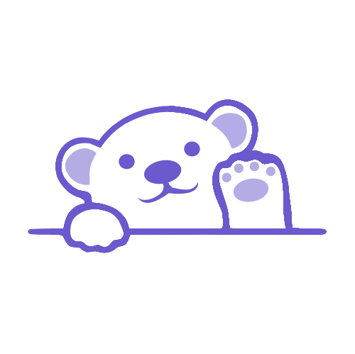

<a id="readme-top"></a>

[![Contributors][contributors-shield]][contributors-url]
[![Forks][forks-shield]][forks-url]
[![Stargazers][stars-shield]][stars-url]
[![Issues][issues-shield]][issues-url]
[![Unlicense License][license-shield]][license-url]
[![LinkedIn][linkedin-shield]][linkedin-url]

<!-- PROJECT LOGO -->
<br />
<div align="center">
  <a href="https://github.com/les1g">
    
  </a>

  <h3 align="center">Personal Website</h3>

  <p align="center">
    Behind the scenes of my personal website!
    <br />
    <a href="https://github.com/les1g/urban-palm-tree"><strong>Explore the docs »</strong></a>
    <br />
    <br />
    <a href="https://github.com/othneildrew/Best-README-Template">View Demo</a>
    &middot;
    <a href="https://github.com/les1g/urban-palm-tree/issues/new">Report Bug</a>
    &middot;
    <a href="https://github.com/othneildrew/Best-README-Template/issues/new?labels=enhancement&template=feature-request---.md">Request Feature</a>
  </p>
</div>

<!-- TABLE OF CONTENTS -->
<details>
  <summary>Table of Contents</summary>
  <ol>
    <li>
      <a href="#about-the-project">About The Project</a>
      <ul>
        <li><a href="#built-with">Built With</a></li>
      </ul>
    </li>
    <li>
      <a href="#getting-started">Getting Started</a>
      <ul>
        <li><a href="#prerequisites">Prerequisites</a></li>
        <li><a href="#installation">Installation</a></li>
      </ul>
    </li>
    <li><a href="#roadmap">Roadmap</a></li>
    <li><a href="#contributing">Contributing</a></li>
    <li><a href="#license">License</a></li>
    <li><a href="#contact">Contact</a></li>
    <li><a href="#acknowledgments">Acknowledgments</a></li>
  </ol>
</details>

<!-- ABOUT THE PROJECT -->

## About The Project

[![Product Name Screen Shot][product-screenshot]](https://example.com)

I made this website to serve as a central hub to highlight my work and provide an easy way to connect with me. It’s designed to showcase my projects, share my professional background, and offer simple ways to get in touch.

My site features the following:

- **Portfolio** – A showcase of projects
- **Resume** – Downloadable PDF
- **Contact** – Contact Form Using FormSpree

<p align="right">(<a href="#readme-top">back to top</a>)</p>

### Built With

- [![Next][Next.js]][Next-url]
- [![TypeScript][TypeScript]][TypeScript-url]
- [![React][React.js]][React-url]
- [![Vercel][Vercel]][Vercel-url]

<p align="right">(<a href="#readme-top">back to top</a>)</p>

<!-- GETTING STARTED -->

## Getting Started

To get a local copy up and running follow these simple example steps.

### Prerequisites

- Node.js 18+
- npm

### Installation

1. Clone the repo
   ```sh
   git clone https://github.com/les1g/urban-palm-tree.git
   cd urban-palm-tree
   ```
2. Install NPM packages
   ```sh
   npm install
   ```
3. Start development server
   ```sh
   npm run dev
   ```
4. Open your browser and go to: http://localhost:3000

<p align="right">(<a href="#readme-top">back to top</a>)</p>

<!-- ROADMAP -->

## Roadmap

[x] App Router pages: Home, About, Portfolio, Resume, Contact/Form

- [x] Header/Footer, BackToTop, ScrollProgress, CustomCursor
- [x] Contact form
- [x] Theme: light/dark toggle with system preference
- [x] Image optimization: Next/Image domains in next.config.js
- [ ] Tests: Jest + React Testing Library for components
- [ ] CI: GitHub Actions for lint, typecheck, test
- [ ] Analytics: Vercel Analytics or GA4

See the [open issues](https://github.com/les1g/urban-palm-tree/issues) for a full list of proposed features (and known issues).

<p align="right">(<a href="#readme-top">back to top</a>)</p>

<!-- CONTRIBUTING -->

## Contributing

Contributions are what make the open source community such an amazing place to learn, inspire, and create. Any contributions you make are **greatly appreciated**.

If you have a suggestion that would make this better, please fork the repo and create a pull request. You can also simply open an issue with the tag "enhancement".
Don't forget to give the project a star! Thanks again!

1. Fork the Project
2. Create your Feature Branch (`git checkout -b feature/AmazingFeature`)
3. Commit your Changes (`git commit -m 'Add some AmazingFeature'`)
4. Push to the Branch (`git push origin feature/AmazingFeature`)
5. Open a Pull Request

### Top contributors:

<a href="https://github.com/les1g/urban-palm-tree/graphs/contributors">

</a>

<p align="right">(<a href="#readme-top">back to top</a>)</p>

<!-- LICENSE -->

## License

Distributed under the Unlicense License. See `LICENSE.txt` for more information.

<p align="right">(<a href="#readme-top">back to top</a>)</p>

<!-- CONTACT -->

## Contact

Gisel Garrido - [@les1g.bsky.social](https://bsky.app/profile/les1g.bsky.social) - ggarr55@icloud.com

Project Link: [https://github.com/les1g/urban-palm-tree](https://github.com/les1g/urban-palm-tree)

<p align="right">(<a href="#readme-top">back to top</a>)</p>

<!-- ACKNOWLEDGMENTS -->

## Acknowledgments

- [Choose an Open Source License](https://choosealicense.com)
- [GitHub Emoji Cheat Sheet](https://www.webpagefx.com/tools/emoji-cheat-sheet)
- [Malven's Flexbox Cheatsheet](https://flexbox.malven.co/)
- [Malven's Grid Cheatsheet](https://grid.malven.co/)
- [Img Shields](https://shields.io)
- [GitHub Pages](https://pages.github.com)
- [Font Awesome](https://fontawesome.com)
- [React Icons](https://react-icons.github.io/react-icons/search)

<p align="right">(<a href="#readme-top">back to top</a>)</p>

<!-- MARKDOWN LINKS & IMAGES -->
<!-- https://www.markdownguide.org/basic-syntax/#reference-style-links -->

[contributors-shield]: https://img.shields.io/github/contributors/les1g/urban-palm-tree.svg?style=for-the-badge
[contributors-url]: https://github.com/les1g/urban-palm-tree/graphs/contributors
[forks-shield]: https://img.shields.io/github/forks/les1g/urban-palm-tree.svg?style=for-the-badge
[forks-url]: https://github.com/les1g/urban-palm-tree/network/members
[stars-shield]: https://img.shields.io/github/stars/les1g/urban-palm-tree.svg?style=for-the-badge
[stars-url]: https://github.com/les1g/urban-palm-tree/stargazers
[issues-shield]: https://img.shields.io/github/issues/les1g/urban-palm-tree.svg?style=for-the-badge
[issues-url]: https://github.com/les1g/urban-palm-tree/issues
[license-shield]: https://img.shields.io/github/license/les1g/urban-palm-tree.svg?style=for-the-badge
[license-url]: https://github.com/les1g/urban-palm-tree/blob/main/LICENSE
[linkedin-shield]: https://img.shields.io/badge/-LinkedIn-0077B5?style=for-the-badge&logo=linkedin&logoColor=white
[linkedin-url]: https://linkedin.com/in/gisel-garrido
[product-screenshot]: public/demp1.png
[Next.js]: https://img.shields.io/badge/Next.js-black?style=for-the-badge&logo=next.js&logoColor=white
[Next-url]: https://nextjs.org/
[TypeScript]: https://img.shields.io/badge/TypeScript-blue?style=for-the-badge&logo=typescript&logoColor=white
[TypeScript-url]: https://www.typescriptlang.org/
[Vercel]: https://img.shields.io/badge/Vercel-black?style=for-the-badge&logo=vercel&logoColor=white
[Vercel-url]: https://vercel.com/
[React.js]: https://img.shields.io/badge/React-darkblue?style=for-the-badge&logo=react&logoColor=61DAFB
[React-url]: https://reactjs.org/
